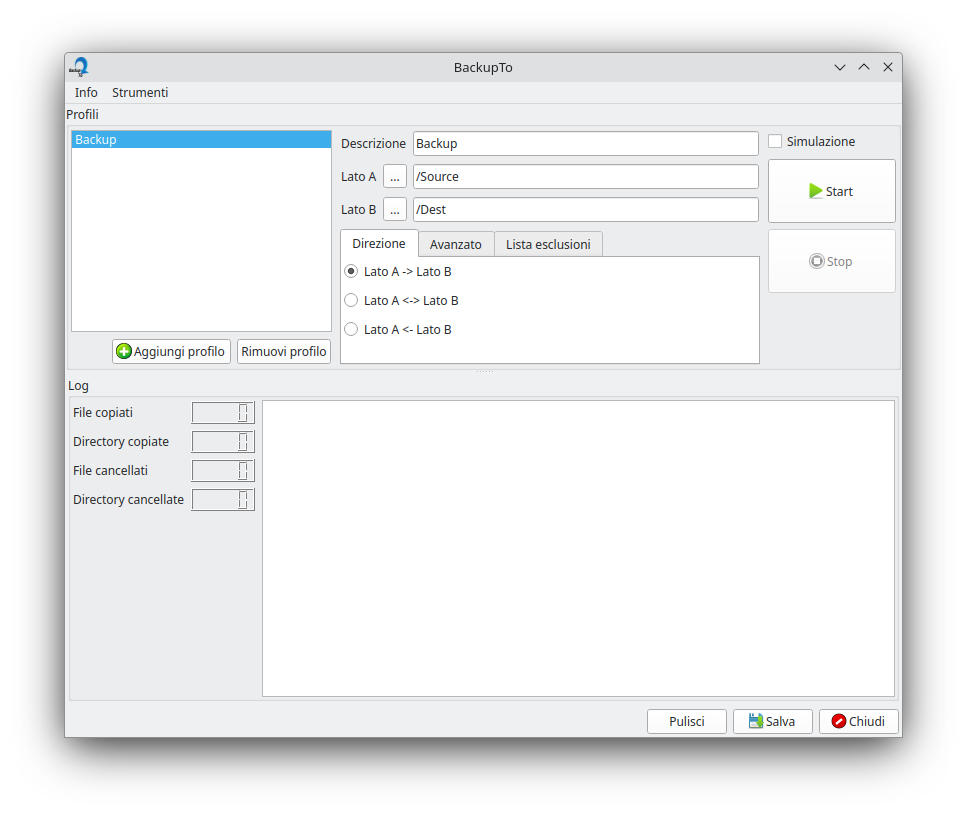

# BackupTo
Keeps aligned 2 or more directories, changes the attributes of a file, flush a directory and in the future other functions.

## Features

- Exclusion files and directories list

## Download BackupTo for Windows and Mac OSX
[https://www.denisgottardello.it/BackupTo/](https://www.denisgottardello.it/BackupTo/)
